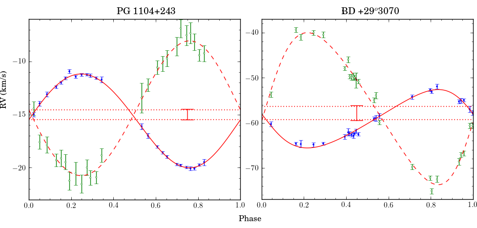
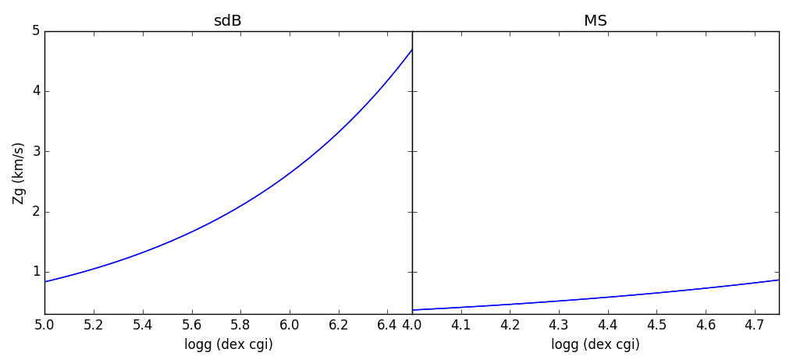

 
Gravitational Redshift
======================

When light is originating from a source in a strong gravitational field, as is the case for light emitted by a compact object as an sdB star, it will be redshifted. This is a direct consequence of time dilation. For more info on this topic see f.x. the wikipedia pages of gravitational redshift and time dilation. 

Observational
-------------
In the case of single stars, gravitational redshif, can not be measured, as there is no way to disentangle between the redshift originating from the motion of the star, or the gravitational redshift. However, in the case of binary systems in which one of the components has a much higher gravitational field as the companion, the gravitational redshift will be visible as a shift in system velocity between the two components, as is for example the case in PG1104+234 and BD+29.3070:

As the gravitational redshift is proportional to the square root of the surface gravity, this effect is only substantial when there is a large difference in :math:`\log{g}` between both components, as is the case for compact stars (fx. white dwarfs, neutron stars, hot subdwarfs,...) with main-sequence or dwarf companions.

Deriving the surface gravity of the compact object
--------------------------------------------------

So what is the use of this, except that you need to remember to fit separate system velocities to the RV curves. If you can measure the difference in system velocity accuratly, can estimate the masses of both components and you can estimate the surface gravity of the low gravity companion, you can use the measuered gravitational redshift to estimate the surface gravity of the compact object.  

Mathematical derivation
^^^^^^^^^^^^^^^^^^^^^^^

General relativity shows that the gravitational redshift as a function of the mass and surface gravity of the star is given by `Einstein 1916 <http://www.ibiblio.org/ebooks/Einstein/Einstein_Relativity.pdf>`_:

.. math::
   z_{\rm g} = \frac{1}{\rm c} \sqrt{G M g}, \label{e-gr}

where:
 * :math:`z_{\rm g}` : the gravitational redshift in cm/s
 * c =  29979245800,  the speed of light in cm/s
 * G = 6.67384e-08,  the gravitational constant in cgs units
 * M : the mass in gr.
 * g : the surface gravity in cgs (:math:`10^{\log{g}}`)
 
To get the difference in system velocity (:math:`\Delta \gamma` in cm/s) we need to subtract the gravitational redshift of both components:

.. math::
   \Delta \gamma = \frac{\sqrt{G}}{c} ( \sqrt{M_{\rm sdB} g_{\rm sdB}} - \sqrt{M_{\rm MS} g_{\rm MS}} )
   
Thus the surface gravity of the sdB star can be estimated as:

.. math::
   g_{\rm sdB} = \frac{1}{M_{\rm sdB}} \left( \frac{c \Delta \gamma}{\sqrt{G}} + \sqrt{M_{\rm MS} g_{\rm MS}} \right)^2

It is quite difficult to propagate errors in the above equation, so to get an error value on the surface gravity of the sdB star it is easier to use a Monte Carlo approach. See the python implementation below. 
   
Python implementation
^^^^^^^^^^^^^^^^^^^^^
   
In python we define the following functions that calculates :math:`z_{\rm g}` in km/s when given the mass and surface gravity, and that calculate :math:`\log{g}_{\rm sdB}` when given :math:`\Delta \gamma`, the two component masses and :math:`\log{g}_{\rm MS}`.

.. code-block:: python
   
   import numpy as np
   from ivs.units import conversions as cv
   from ivs.units import constants as cc
   
   def zg(M, logg):
      M = cv.convert('Msol', 'g', M)
      return cv.convert('cm/s', 'km/s', np.sqrt(cc.GG_cgs * M * 10**logg) / cc.cc_cgs)
         
   def logg(Dgamma, Msdb, Mms, loggms):
      Dgamma *= 1e5 # km/s -> mc/s
      Msdb *= 1.988547e+33 # Msol -> g
      Mms *= 1.988547e+33 # Msol -> g
      
      g = ( cc.cc_cgs * Dgamma / np.sqrt(cc.GG_cgs) + np.sqrt(Mms * 10**loggms) )**2 / Msdb
      return np.log10(g)
         
Lets see how this would look for an sdB and an MS star:

.. code-block:: python
   
   import pylab as pl
   
   pl.subplot(121)
   pl.plot(np.linspace(5.0, 6.5), zg(0.47, np.linspace(5.0, 6.5)))
   
   pl.subplot(122)
   pl.plot(np.linspace(4.0, 4.75), zg(0.90, np.linspace(4.0, 4.75)))
   pl.show()
   

 
the gravitational redshift of the sdB star is obviously much stronger as that of the MS star, due to the dependence on :math:`\sqrt{g}`. 

Error estimation
^^^^^^^^^^^^^^^^

To get errors on the derived surface gravity we can implement a simple Monte Carlo approach. We perturb the input parameters by there errors <n> times, and then take the standard deviation from the resulting values as the error. The larger <n>, the better the estimate, but you don't need to overdo it. Around 1000 iterations is usually sufficient.

The following function should be called with for each argument a tuple containing (value, error), and will return the surface gravity as a tuple of (logg, e_logg).

.. code-block:: python
   
   def logg_mc(Dgamma, Msdb, Mms, loggms, iter=1024):
      Dgamma = np.random.normal(Dgamma[0], Dgamma[1], iter)
      Msdb = np.random.normal(Msdb[0], Msdb[1], iter)
      Mms = np.random.normal(Mms[0], Mms[1], iter)
      loggms = np.random.normal(loggms[0], loggms[1], iter)
      
      g = logg(Dgamma, Msdb, Mms, loggms)
      return np.average(g), np.std(g)
   
   logg_mc((2.0, 0.5), (0.47, 0.05), (0.9, 0.1), (4.35, 0.15), iter=1024)
   >>> (5.9533888972813394, 0.19010161589675589)

There are a few uncertainties that one needs to take into account when deriving the surface gravity of the compact object in this way. 

 * **System velocity**: If different lines and or methods are used to determine the radial velocities of both components, this will give an error on the system velocities. For example you might be using a linelist with vacuum wavelengths for one star, and atmospheric wavelengths for the other. The difference between air and vacuum will cause RV shifts of ~100 km/s, so you won't make this mistake, but be aware of other systemic errors.
 
 * **line list uncertainties**: If you use many lines to determine the radial velocities this won't be an issue. But in many compact objects there are only a few suitable lines. So the uncertainty on the rest wavelength of the used lines becomes important. F.x. in the case of sdB stars, the wavelength of the He I :math:`\lambda` 5875 multiplet is only known with a presision of :math:`\sim` 0.01 A, corresponding to a systematic radial velocity uncertainty of up to :math:`\sim` 0.5 :math:`\rm{km\,s}^{-1}`.

 
Python sources
--------------
 
 * script to calculate logg based on the system velocity: :download:`scripts/Zg2logg.py`