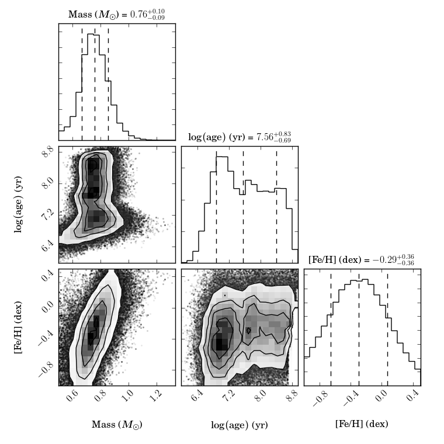

 
Spectroscopic mass determination
================================

If spectroscopic parameters as effective temperature, surface gravity and metallicity of a star are known, they can be compared to stellar evolution models to determine the spectroscopic mass of the star. We can do this for both sdB stars, and the cool companions. However, because the atmospheric properties of sdB stars are complicated, and theory evolves fast, the results for sdB stars would likely be unreliable. Main sequence stars on the other hand are very well studied, and even though there are still some discrepancies, stellar evolution models match up very well with the observed spectroscopic parameters.  

The bare minimum necessary to detemine a spectroscopic mass is a reliable observations of the effective temperature, surface gravity and metalicity. If you have other observed parameters, as for example luminosity or radius, this will of course improve the estimate. 

Fitting
-------

To determine the mass you will have to fit a stellar evolution model depending on three parameters (Mass, Age, Z) to the observed properties. This is somewhat complicated by the metalicity being both a model parameter and an observed property. Meaning that you need to fit it while varying it. 
Even though, the fitting can be done with a simple minimizer, or even by hand. 

The error determination is somewhat more complicated. The best way to go about this is to use a Markov chain Monte Carlo approach. Such an approach allows you to cover the entire parameter space, giving you the global minimum, and it will provide you with the distributions of all three model parameters from which you can determine the error with any probability interval (f.x. :math:`1\sigma - 3\sigma`) you want.

I know of two existing codes that can be used for this, but there might be more:

BAGEMASS
^^^^^^^^
A fortran implementation of an MCMC code to determine stellar masses is BAGEMASS from `Maxted et al. 2015 <https://arxiv.org/abs/1412.7891>`_. This is a fast code using the Yale-Potsdam stellar isochrones (`YaPSI <http://www.astro.yale.edu/yapsi/>`_). The downside of this code is that the observables (Teff, R, Fe/H, L) are hardcoded and can't be changed without rewriting fortran code. But if you have these observables it is as easy as plugging in their values and errors and pressing enter.

BAGEMASS can be obtained from sourceforge: https://sourceforge.net/projects/bagemass/

EMCMASS
^^^^^^^
EMCMASS is a python 'port' of the BAGEMASS tool I have written that makes it easier to change the observables and the stellar evolution models. It relies on the `EMCEE <http://dan.iel.fm/emcee/current/>`_ code from `Foreman-Mackey et al. 2013 <https://arxiv.org/abs/1202.3665>`_ for the MCMC part. The observables can be any combination of Teff, logg, logL, logR and [M/H]. Both the YaPSI isochrones from BAGEMASS and the MESA isochrones and stellar tracks (`MIST <http://waps.cfa.harvard.edu/MIST/>`_), are included. You can even change which model parameters you would like to use, although I can't imagine why you would want to do this. Full documentation on how to use EMCMASS is included with the code.

EMCEE can be obtained from github: https://github.com/Alegria01/emcmass

Example using EMCEE
-------------------

Say we want to determine the mass of the K-type companion of HE0430-2457 (incidentily this was the system that the EMCEE code was writen for). Observed properties of this system are: 
 * Teff: 4700 :math:`\pm` 500
 * logg: 4.50 :math:`\pm` 0.50
 * Fe/H: -0.42 :math:`\pm` 0.40
 * logL: -0.58 :math:`\pm` 0.15
 
EMCEE needs the log of the effective temperature, so this becomes: :math:`\log{T_{\rm eff}} = 3.67 \pm 0.05`. You can run the *emcmass* script from the command line with the above input as follows:

>>> python emcmass.py -model yapsi -mass 0.2 1.25 -age 7.5 10.3 log_L -0.58 0.15 log_Teff 3.67 0.05 log_g 4.70 0.40 M_H -0.42 0.40

This will produce a bunch of text output describing the setup and produce the following graph with the results

   
The mass is well determined at :math:`M_{\rm K} = 0.76 \pm 0.10` and the metalicity of the best fitting model corresponds well with the original metalicity. However, the age can not really be determined. The best we can say is that it is a main sequence star. There is a slightly higher probability that it is a younger MS star, but it would not be very smart to put much thrust in that.