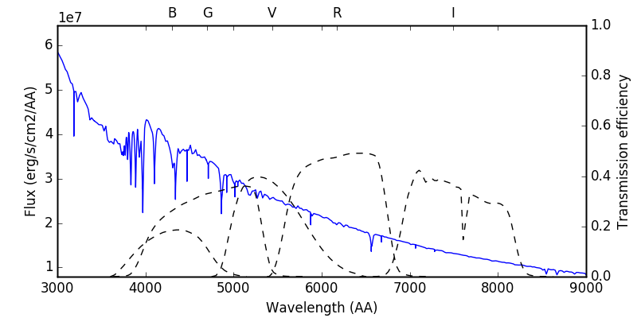
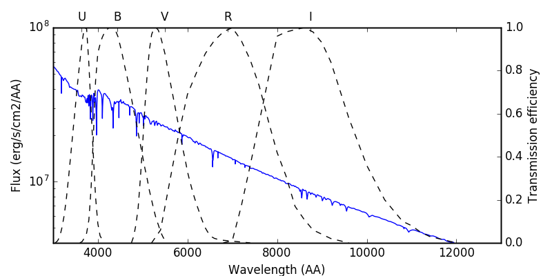
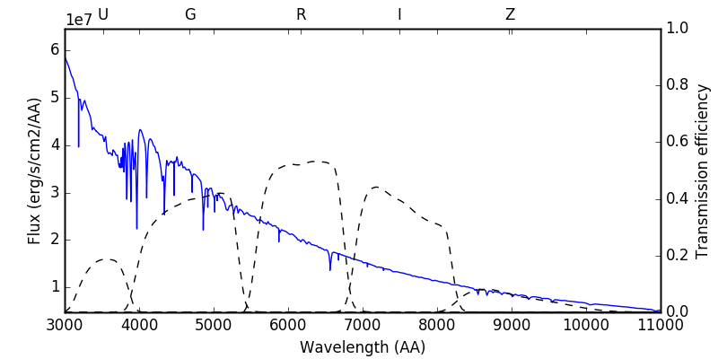
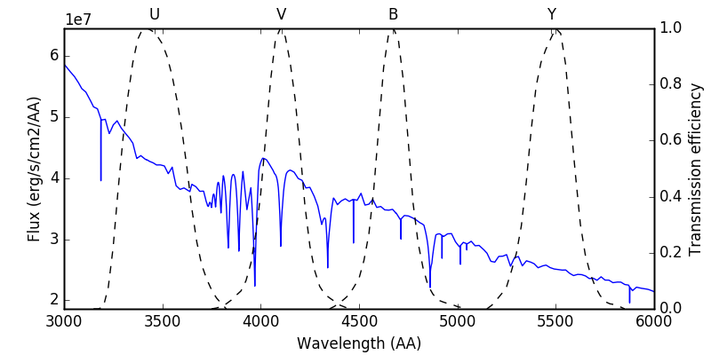
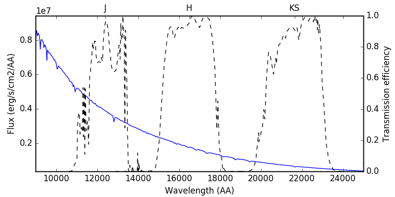

 
Photometric passbands 
=====================

The photometric pass bands a.k.a. filters are kept in ivs/sed/filters. Functions to work with them are included in the sed.filters module of the ivs repository. A whole load of known filters are included by default, and if neccessary new filters can be added temporarily on the fly, or permanently by adding the transmission curves and hard coding the necessary information in the zeropoints file.

Available response functions
----------------------------

To print a list of all available systems:

.. code-block:: python

   from ivs.sed import filters
   
   responses = filters.list_response()
   systems = set([response.split('.')[0] for response in responses])
   for system in systems:
      bands = [band.split('.')[-1] for band in filters.list_response(name=system)]
      temp = "*{:>17s}: " + " ".join(["{}" for b in bands])
      print temp.format(system, *bands)

Obtaining the response curve of a specific filter, fx. the 2MASS J filter, can be done with:

.. code-block:: python

   wave, transmission = filters.get_response('2MASS.J')
      
Transmission curves of some of the most commonly used systems plotted over a spectrum of an sdB+F type binary. The code to make these plots: :download:`scripts/plot_response_curves.py`.

APASS 
^^^^^
   

JOHNSON 
^^^^^^^
   

SDSS 
^^^^
   

   
STROMGREN
^^^^^^^^^
   

2MASS
^^^^^
   

   
The zeropoints file
-------------------

All necessary information to convert magnitudes to fluxes and vice versa for the filters is stored in the ivs/sed/zeropoints.dat file. This file contains for each filter the following information:
  
* eff_wave (float): effective wavelength
* type (str): What type the detector is, CCD or BOL (Bolometer)
* vegamag (float): zeropoint in the Vega system
* vegamag_lit (int): flag to indicate if the vegamag is taken from literature
* ABmag (float): zeropoint in the AB system
* ABmag_lit (int): flag to indicate if the ABmag is taken from literature
* STmag (float): zeropoint in the ST system
* STmag_lit (int): flag to indicate if the STmag is taken from literature
* Flam0 (float): Reference flux in :math:`F_{\lambda}` units
* Flam0_units (str): units of the reference flux
* Flam0_lit (int): flag to indicate that Flam0 is taken from literature
* Fnu0 (float): Reference flux in :math:`F_{\nu}` units
* Fnu0_units (str): units of the reference flux
* Fnu0_lit (int): flag to indicate that Fnu0 is taken from literature
* source (str): source for the literature values

Obviously not all of these values need to be defined. If your filter is calibrated in the Vega system, then the AB and ST zeropoints should be set to nan, and the reference wavelengths are derived from the Vega flux. To calculate these values for new filters, see :any:`sed/zeropoint_derivation`.

Pay Attention: The zero points derived in :any:`sed/zeropoint_derivation` are the inverse of the ones that need to be added to the zeropoints file. So if you calculate a VEGA zeropoint of :math:`Zp = 0.02` as described in that section, you need to add :math:`-0.02` for that filter in the vegamag column in the zeropoints.dat file.
   
Permanently adding a new filter
-------------------------------

Add a new response curve file to the ivs/sed/filters directory. The file should contain two columns, the first column is the wavelength in angstrom, the second column is the transmission curve. The units of the later are not important. Afterwards call the update info function

.. code-block:: python

   from ivs.sed import filters
   filters.update_info()

The contents of the zeropoints.dat file that is located in ivs/sed will automatically be updated. Make sure to add any additional information on the new filters manually in that file (e.g. is t a CCD or bolometer, what are the zeropoint magnitudes etc).

Temporarily adding a new filter
-------------------------------

You can add custom filters on the fly using L{add_custom_filter}. In this
example we add a weird-looking filter and check the definition of Flambda and
Fnu and its relation to the effective wavelength of a passband:

Prerequisites: some modules that come in handy:

.. code-block:: python

   from ivs.sigproc import funclib
   from ivs.sed import model
   from ivs.units import conversions

First, we'll define a double peakd Gaussian profile on the wavelength grid of
the WISE.W3 response curve:

.. code-block:: python

   wave = get_response('WISE.W3')[0]
   trans = funclib.evaluate('gauss',wave,[1.5,76000.,10000.,0.])
   trans+= funclib.evaluate('gauss',wave,[1.0,160000.,25000.,0.])

This is what it looks like:

.. code-block:: python

   p = pl.figure()
   p = pl.plot(wave/1e4,trans,'k-')
   p = pl.xlabel("Wavelength [micron]")
   p = pl.ylabel("Transmission [arbitrary units]")

We can add this filter to the list of predefined filters in the following way
(for the doctests to work, we have to do a little work around and call
filters via that module, this is not needed in a normal workflow):

.. code-block:: python

   model.filters.add_custom_filter(wave,trans,photband='LAMBDA.CCD',type='CCD')
   model.filters.add_custom_filter(wave,trans,photband='LAMBDA.BOL',type='BOL')

Note that we add the filter twice, once assuming that it is mounted on a
bolometer, and once on a CCD device. We'll call the filter C{LAMBDA.CCD} and
C{LAMBDA.BOL}. From now on, they are available within functions as L{get_info}
and L{get_response}. For example, what is the effective (actually pivot)
wavelength?

.. code-block:: python

   effwave_ccd = model.filters.eff_wave('LAMBDA.CCD')
   effwave_bol = model.filters.eff_wave('LAMBDA.BOL')

Let's do some synthetic photometry now. Suppose we have a black body atmosphere:

.. code-block:: python

   bb = model.blackbody(wave,5777.)

We now calculate the synthetic flux, assuming the CCD and BOL device. We
compute the synthetic flux both in Flambda and Fnu:

.. code-block:: python

   flam_ccd,flam_bol = model.synthetic_flux(wave,bb,['LAMBDA.CCD','LAMBDA.BOL'])
   fnu_ccd,fnu_bol = model.synthetic_flux(wave,bb,['LAMBDA.CCD','LAMBDA.BOL'],units=['FNU','FNU'])

You can see that the fluxes can be quite different when you assume photon or
energy counting devices!

Can we now readily convert Flambda to Fnu with assuming the pivot wavelength?

.. code-block:: python

   fnu_fromflam_ccd = conversions.convert('erg/s/cm2/AA','erg/s/cm2/Hz',flam_ccd,wave=(effwave_ccd,'A'))
   fnu_fromflam_bol = conversions.convert('erg/s/cm2/AA','erg/s/cm2/Hz',flam_bol,wave=(effwave_bol,'A'))

Which is equivalent with:

.. code-block:: python

   fnu_fromflam_ccd = conversions.convert('erg/s/cm2/AA','erg/s/cm2/Hz',flam_ccd,photband='LAMBDA.CCD')
   fnu_fromflam_bol = conversions.convert('erg/s/cm2/AA','erg/s/cm2/Hz',flam_bol,photband='LAMBDA.BOL')

Apparently, with the definition of pivot wavelength, you can safely convert from
Fnu to Flambda

Temporarily modifying an existing filter
----------------------------------------

Under usual conditions, you are prohibited from overwriting an existing predefined
response curve. That is, if you try to L{add_custom_filter} with a C{photband}
that already exists as a file, a C{ValueError} will be raised (this is not the
case for a custom defined filter, which you can overwrite without problems!).
If, for testing purposes, you want to use another definition of a predefined
response curve, you need to set C{force=True} in L{add_custom_filter}, and then
call

.. code-block:: python

   set_prefer_file(False)

To reset and use the original definitions again, do

.. code-block:: python

   set_prefer_file(True)

