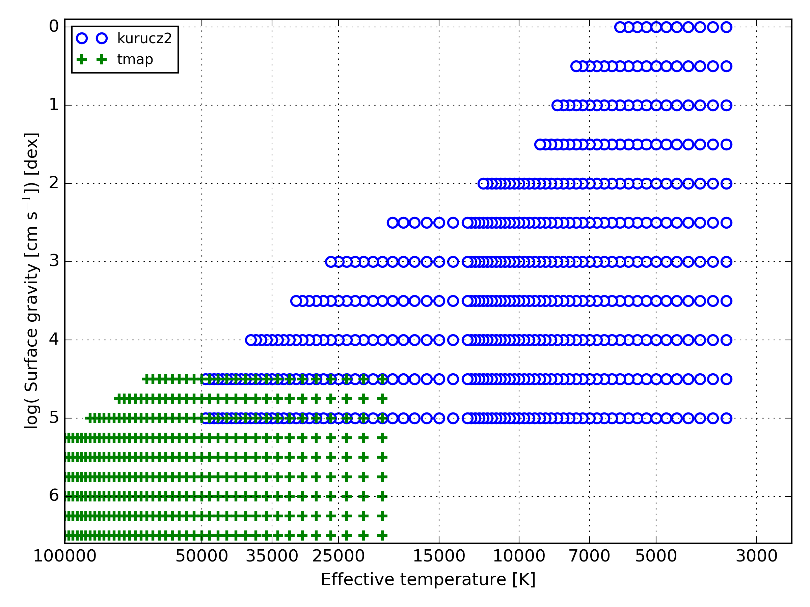
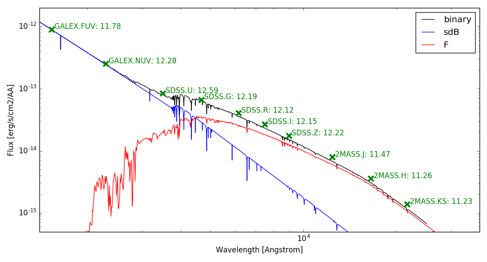

 
Models for SED fitting
======================

The model library of ivs.sed contains functions to retrieve model SEDs and integrated photometry from pre-integrated model grids in a fast and easy way. In this section we describe some commonly used models, how to set which models to use by defaults, and how to obtain model SEDs and integrated photometry. 

Adding new models and creating pre-integrated model grids is covered in further sections.

The most default use of this module is:

.. code-block:: python

   wave, flux = get_table(teff=5850, logg=4.35)
   
Which will retrieve the model SED with the specified effective temperature and logg, from the standard grid, in standard units and with zero reddening. All these things can be specified though.

Models used for composite sdBs
------------------------------

Many differen types of model SEDs exists, and even though some of them span large chunks of the teff-logg space, every one of them has specific applications where it is optimized for. The SED fitting library comes with several different model SEDs some of which have more documentation then others. Below we briefly describe some of the more usefull models in the case of composite sdBs.

Model grids don't necissarily need to be square in Teff-logg, the SED fitting routine will take care of any grid points that might fall outside of the available grid space.

To get all gridpoints for a certain model you can use:

.. code-block:: python
   
   teffs,loggs = model.get_grid_dimensions(grid='kurucz2')

Code to plot all gridpoints for the models shown below: :download:`scripts/plot_model_grid_ranges.py`.

Kurucz
^^^^^^

The Kurucz model grids, (default setting) reference: Kurucz 1993, yCat, 6039, 0

+-----+-------+------+--------+
|     | Teff  | logg | [Fe/H] |
+=====+=======+======+========+
| min |  3500 | 0.0  | -1.0   |
+-----+-------+------+--------+
| max | 50000 | 5.0  |  0.2   |
+-----+-------+------+--------+

* metallicity (z): m01 is -0.1 log metal abundance relative to solar (solar abundances from Anders and Grevesse 1989)
* metallicity (z): p01 is +0.1 log metal abundance relative to solar (solar abundances from Anders and Grevesse 1989)
* alpha enhancement (alpha): True means alpha enhanced (+0.4)
* turbulent velocity (vturb): vturb in km/s
* nover= True means no overshoot
* odfnew=True means no overshoot but with better opacities and abundances

TMAP
^^^^

NLTE grids computed for sdB stars with the Tubingen NLTE Model Atmosphere package. No further parameters are available. Reference: Werner et al. 2003

+-----+--------+------+--------+
|     | Teff   | logg | [Fe/H] |
+=====+========+======+========+
| min | 20000  | 5.0  | solar  |
+-----+--------+------+ only   +
| max | 100000 | 6.5  |        |
+-----+--------+------+--------+

Marcs
^^^^^

Model retrieval
---------------

The model module of the sed library provides interfaces to retrieve model SEDs and integrated photometry of those models. It provides access points both to obtain a model SED, one integrated model or a whole bunch of integrated models in one go. The latter is very useful in the fitting process, but will seldomly be called directly. All three functions are discussed below. 

The model interface allows you to get models and integrated photometry for single stars as well as for binary models. In fact, you are not limited to a binary model at all, you can combine as many models as you want. However, in most practical user cases, two models will be suficient. The interface to obtain single star models is the same as that for binary models. The functions will automatically determine what you want from the input arguments you provide. 

Setting the defaults
^^^^^^^^^^^^^^^^^^^^

To load a model the model library needs to know from where it should get this model. These settings are stored in the defaults and defaults_multiple dictionaries of the model interface.

Not all default parameters are relevant for all grids. The irrelevant parameters will just be ignored.

The default single model is a kurucs model with solar metalicity and no alpha enhancement using the odfnew set. For the integrated model the Fitzpatrick 2004 reddening law with an Rv of 3.1 are set.
For binary systems the default setup is copied for each model

.. code-block:: python

   print model.defaults
   
   {'He': 97, 'Rv': 3.1, 'a': 0.0, 'alpha': False, 'c': 0.5, 'co': 1.05, 'ct': 'mlt', 'grid': 'kurucz2', 'law': 'fitzpatrick2004', 
    'm': 1.0, 'nover': False, 'odfnew': True, 't': 1.0, 'use_scratch': False, 'vturb': 2, 'z': 0.0}
   
   print model.defaults_multiple
   
   [ {'He': 97, 'Rv': 3.1, 'a': 0.0, 'alpha': False, 'c': 0.5, 'co': 1.05, 'ct': 'mlt', 'grid': 'kurucz2', 'law': 'fitzpatrick2004', 
     'm': 1.0, 'nover': False, 'odfnew': True, 't': 1.0, 'use_scratch': False, 'vturb': 2, 'z': 0.0},
     {'He': 97, 'Rv': 3.1, 'a': 0.0, 'alpha': False, 'c': 0.5, 'co': 1.05, 'ct': 'mlt', 'grid': 'kurucz2', 'law': 'fitzpatrick2004', 
     'm': 1.0, 'nover': False, 'odfnew': True, 't': 1.0, 'use_scratch': False, 'vturb': 2, 'z': 0.0} ]
     
You can change the default settings with set_defaults. 

.. code-block:: python

   model.set_defaults(z=-0.5)
   
And in the case of a binary or higher order model you can use the set_defaults_multiple function. This function accepts dictionaries as arguments, where each dictionary contains the default settings for that component. You can add as many components as you want. For example if we want to set defaults for and sdB+MS binary we can set:

.. code-block:: python
   
   grid1 = {'grid':'tmap', 'law': 'fitzpatrick2004', 'Rv': 3.1}
   grid2 = {'grid':'kurucz', 'law': 'fitzpatrick2004', 'Rv': 3.1}
   model.set_defaults_multiple(grid1, grid2)
   
Instead of setting the defaults, you can also provide the grid keywords directly to the function to obtain the models.
   
Model SEDs
^^^^^^^^^^

To obtain a model SED, use the get_table function. This function accepts arguments for a limitless range of components. 

The effective temperature and surface gravity are interpolated, the metalicity is available for the used model grid needs to be a gridpoint, and the reddening can be whatever you want as it is calculated on the spot. You can provide the specific reddening law and Rv value as kwargs. 

For binary or multiple models, the reddening related settings are considered to be the same for all components. It makes sense to have the same value for the reddening (ebv) of all components, but this is not enforced nor checked.

Accepted keywords for stellar properties:

* teff: effective temperature in K
* logg: log(surface gravity) in dex cgi
* rad: radius in Rsol
* z: metalicity in the units as defined for the model grid
* ebv: E(B-V) reddening unitless

Extra keywords:

* wave_units: units for the wavelength (angstrom)
* flux_units: units for the flux (erg/cm2/s/AA/sr)
* grids: specifications for which grid to use

.. code-block:: python

   # single model
   wave, flux = model.get_table(teff=6200, logg=4.3, z=-0.5, ebv=0.025)
   
   # binary model assuming defaults are set to tmap and kurucz
   wave, flux = model.get_table(teff1=28000, logg1=5.8, rad1=0.15, ebv1=0.01,
                                teff2=6200,  logg2=4.3, rad2=1.10, ebv2=0.01)
                                
Defining which grid to use can be done by setting the defaults or by providing the grid keywords directly to the function. Following two function calls are equivalent

.. code-block:: python

   grid1 = {'grid':'tmap', 'law': 'fitzpatrick2004', 'Rv': 3.1}
   grid2 = {'grid':'kurucz', 'law': 'fitzpatrick2004', 'Rv': 3.1}
   
   # method 1
   model.set_defaults_multiple(grid1, grid2)
   wave, flux = model.get_table(teff1=28000, logg1=5.8, rad1=0.15, ebv1=0.01,
                                teff2=6200,  logg2=4.3, rad2=1.10, ebv2=0.01)
   
   # method 2
   wave, flux = model.get_table(teff1=28000, logg1=5.8, rad1=0.15, ebv1=0.01,
                                teff2=6200,  logg2=4.3, rad2=1.10, ebv2=0.01,
                                grids = [grid1, grid2])

Integrated photometry
^^^^^^^^^^^^^^^^^^^^^

Instead of retrieving a model SED, you can immediately retrieve pre-calculated integrated photometry. The benefit of this approach is that it is much faster than retrieving the model SED and then calculating the synthetic flux. Also, you can supply arbitrary metallicities within the grid boundaries, as interpolation is done in effective temperature, surface gravity, reddening and metallicity.

The reddening law and Rv parameter however are fixed in the pre integrated grids. Thus is you want to change them, you need to re-integrate the model SED grid with the new law and/or Rv parameter.

The function arguments are similar to those to obtain the model SEDs, with as added argument a list of bands for which you want to obtain photometry. 

The use for single stars and multiple stars is the same as before.

get_itable will return a list of integrated fluxes and absolute luminosities of the requested model(s). By default no wavelengths are returned because photometric filters can not be trivially asigned a wavelength. However, if the wave_units keyword is specified, also the effective wavelengths of the requested bands will be returned in the units specified. This does not take into account the actual model atmosphere. For that you will have to use the filters.eff_wave function. 

.. code-block:: python
   :caption: A single model
   
   photbands = ['APASS.B','2MASS.J']
   iflux, Labs = model.get_itable(teff=6200, logg=4.3, ebv=0.025, photbands=photbands)
   iwave, iflux, Labs = model.get_itable(teff=6200, logg=4.3, ebv=0.025, photbands=photbands, wave_units='AA')
   
This function returns integrated fluxes and is as such not dependent on the zero points of the filters, only on the transmission curves. To obtain synthetic magnitudes you can use:

.. code-block:: python

   mags = [conversions.convert('erg/s/cm2/AA','mag',fluxes[i],photband=photbands[i]) for i in range(len(photbands))]
   
Keep in mind that these magnitudes are NOT corrected for the distance to the star in question, and can thus not be used in a direct comparison with observations! 

Lists of integrated photometry
^^^^^^^^^^^^^^^^^^^^^^^^^^^^^^

The get_itable function is useful if you are only interested in one model. If however you want integrated photometry for a whole list of stellar parameters a hughe speedup can be accomplished by using the get_itable_pix function: it may take a few tens of seconds to retrieve the first pre-integrated SED, because all available files from the specified grid will be loaded into memory, and a markerarray will be made allowing a binary search in the grid. This makes it easy to retrieve all models around the speficied point in N-dimensional space. Next, a linear interpolation method is applied to predict the photometric values of the specified point.

This function works in the same way as get_itable, but it requires a list of parameters instead of floats. The return values follow the same structure, but will now be arrays.
   
.. code-block:: python
   :caption: A list of models
   
   teffs, loggs = [6150, 5800], [4.45, 4.35]
   iflux, Labs = model.get_itable_pix(teff=teffs, logg=loggs, photbands=photbands)

Example: synthetic SED of an sdB+MS binary
------------------------------------------

Lets use the above information to display the model SED of a 'typical' sdB+MS binary together with the integrated photometry in several bands

Some basic setup with average values for an sdB and an F type companion. 

.. code-block:: python
   
   import numpy as np
   import pylab as pl
   from ivs.sed import model
   from ivs.units import conversions
   
   # standard grids for an sdB and MS star
   grid1 = {'grid':'tmap', 'law': 'fitzpatrick2004', 'Rv': 3.1}
   grid2 = {'grid':'kurucz2', 'law': 'fitzpatrick2004', 'Rv': 3.1}
   model.set_defaults_multiple(grid1, grid2)
   
   # some typical parameters for an sdB and an F-type companion
   teff1, logg1, rad1 = 28000, 5.8, 0.15
   teff2, logg2, rad2 = 6200, 4.35, 1.1
   
   photbands = ['GALEX.FUV', 'GALEX.NUV', 
                'SDSS.U', 'SDSS.G', 'SDSS.R', 'SDSS.I', 'SDSS.Z', 
                '2MASS.J', '2MASS.H', '2MASS.KS']
   

Use the get_table function to get the model SED for the binary model, the sdB and the F-type star. 

.. code-block:: python
   
   wave, flux = model.get_table(teff1=teff1, logg1=logg1, rad1=rad1,
                                teff2=teff2, logg2=logg2, rad2=rad2)
   
   wavesdB, fluxsdB = model.get_table(teff=teff1, logg=logg1, rad=rad1, **grid1)
   
   waveF, fluxF = model.get_table(teff=teff2, logg=logg2, rad=rad2, **grid2)

The get_itable function returns the integrated flux. The wave_units keyword is added so also the effective wavelength of each band is returned.
   
.. code-block:: python
   
   iwave, iflux, Labs = model.get_itable(teff1=teff1, logg1=logg1, rad1=rad1,
                                         teff2=teff2, logg2=logg2, rad2=rad2,
                                         photbands=photbands, wave_units='AA')

We can scale all fluxes to a distance of 500 pc. If we then calculate magnitudes from the fluxes they will be in the same ballpark as the brighter composite sdB binaries. We need to convert the distance from pc to Rsol because we provided the radius is Rsol, and fluxes should be scaled according to:

.. math::
   
   F = \frac{R^2}{d^2} f

In code this becomes:

.. code-block:: python
                                         
   scale = 1 / conversions.convert('pc', 'Rsol', 500)**2
   flux, fluxsdB, fluxF, iflux = flux*scale, fluxsdB*scale, fluxF*scale, iflux*scale

When converting the fluxes to magnitudes there is one more catch to remember. The GALEX magnitudes are defined in the AB system, and should thus be converted to ABmag, while all other bands are defined in the Vega system and can just be converted to mag. 

 .. code-block:: python
 
   units = ['ABmag', 'ABmag'] + ['mag' for i in range(8)]
   mags = [conversions.convert('erg/s/cm2/AA',units[i],iflux[i],photband=photbands[i]) for i in range(len(photbands))]

Now we can plot everything, and anotate the magnitudes on the plot.

 .. code-block:: python
 
   pl.loglog(wave, flux, '-k', label='binary')
   pl.loglog(wavesdB, fluxsdB, '-b', label='sdB')
   pl.loglog(waveF, fluxF, '-r', label='F')
   pl.loglog(iwave, iflux, 'xg', ms=9, mew=3)
   [pl.annotate('{}: {:0.2f}'.format(b,m), (w*1.02,f*1.02), color='g') for b,m,w,f in zip(photbands,mags, iwave, iflux)]
   pl.xlim([1400, 37000])
   pl.ylim([5e-16, 2e-12])
   pl.legend(loc='upper right')
   pl.xlabel('Wavelength [Angstrom]')
   pl.ylabel('Flux [erg/s/cm2/AA]')
   pl.show()
   
   
