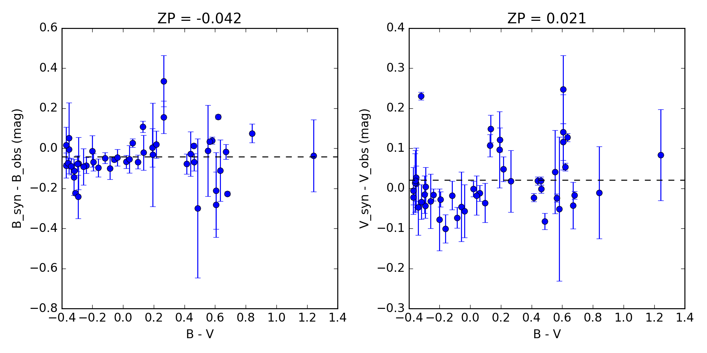

Calibrating Zero points 
=======================

The zero points of photometric filters can be derived from systems for which reliable flux calibrated spectroscopy is avaible. Especially in the case of all sky surveys it is not too hard to find such spectroscopy.

In this page, we will use spectra from the CALSPEC and the NGSL libraries to recalibrate the zeropoints of APASS. 

Spectral libraries
------------------

CALSPEC: `<http://www.stsci.edu/hst/observatory/crds/calspec.html>`_

NGSL: `<https://archive.stsci.edu/prepds/stisngsl/>`_

APASS
-----

APASS is the AAVSO Photometric All-Sky Survey. Its goal is to provide photometric coverage of the entire sky in 5 bands: B, V, g', r' and i', for all objects with a magnitude between 7 and 17. The current release is DR9. 

The B and V filters are Landolt B and V filters in the Vega Mag system. g', r' and i' are SDSS filters in the AB mag system. The filter database of VOSA provide transmission curves for all fiters, which we will use here.

APASS home page: `<https://www.aavso.org/apass>`_

Vizier access to data: `II/336/apass9 <http://vizier.u-strasbg.fr/viz-bin/VizieR?-source=II/336&-to=3>`_

Magnitude vs Flux
-----------------

To convert flux to magnitudes or the reverse, the zero point of the filter needs to be known. The conversion of flux the mag is given by:

.. math:: m = -2.5 \log{\left( \frac{f}{f_0} \right) } + z_p
   :label: magnitude_flux

where :math:`m` is the magnitude, :math:`f` is the flux, :math:`f_0` is the reference flux and :math:`z_p` is the zeropoint. Depending on the magnitude system in use, the reference flux can be calculated as:

.. math:: f_0(\rm Vega) = \int_{\lambda} p(\lambda)\ F_{\rm vega}\ d\lambda

.. math:: f_0(\rm AB) = \int_{\nu} p(\nu)\ 3631\ Jy\ d\nu = \int_{\lambda} p(\lambda) \frac{c}{\lambda^2}\ 3631\ Jy\ d\lambda

where :math:`p` is the transmission curve, :math:`F_{\rm vega}` is the vega flux and 3631 Jy is the constant flux density that is used as a reference in the AB mag system. This corresponds to :math:`3631 \cdot 10^{-23}` erg/s/cm2/Hz.

Zero point derivation
---------------------

If no zero points are published for a given photometric system, it is possible to derived them. To do this, you need to calculate synthetic magnitudes based on flux calibrated spectra, and compare them to actual observed magnitudes. To calculate the magnitudes from the spectra you use equation :eq:`magnitude_flux`, assuming that :math:`z_p=0`. 

The difference between the observed and the synthetic magnitude is then the zero point of that filter. By including lots of spectra, and averaging the derived zero points you can determine an accurate zeropoint as well as the expected error. The standard deviation of the zero points will also give you a reasonable guess on the reliability of the provided photometric errors. If the deviation of the zero points is larger than the errors, they are likely underestimated. 

Transmission curve correctness
------------------------------

If you have flux calibrated spectra of systems from different spectral classes, it is possible to check if the transmission curves you are using are correct. If the transmission curve is correct, the zero point should be completely independent of the spectral type. You can easily check this by plotting the derived zero points versus the color. 

Below the zero points derived for 56 systems in the 2MASS Ks are plotted versus the J - Ks color. There is a negelectable slope of -0.01 in the distribution, indicating that there is no significant variation of the zero point with spectral type. The transmission curve is thus likely correct.

.. image:: images/zero_point_2MASS_Ks.png
   :width: 50em
   
Full example
------------

Using the ivs python repository, we can derive zero points and the correlation between color and zero point using spectra from fx. CALSPEC. We assume that we have a file in which we list all systems together with the path to the spectrum, and the path to the photometry file. The basics of the code is given below, and a more detailed script can be obtained: :download:`scripts/calculate_zeropoints.py`.

Necessary imports:

.. code-block:: python
   
   import pyfits

   import numpy as np
   import pylab as pl

   from ivs.sed import model
   from ivs.io import ascii
   from ivs.units import conversions as cv
   from ivs.units import constants as cc
   
Start with calculating the reference fluxes assuming that the B and V bands are in the Vega reference system. The flux calibrated vega spectrum (alpha_lyr_stis_008.fits) is provided by CALSPEC. The units of Flam_0 are erg/s/cm2/AA, because the flux of Vega is provided in these units.

.. code-block:: python

   photbands = ['APASS.B', 'APASS.V']
   
   hdu = pyfits.open('alpha_lyr_stis_008.fits')
   wave, flux = hdu[1].data['wavelength'], hdu[1].data['flux']
   hdu.close()
   
   Flam_0 = model.synthetic_flux(wave,flux,photbands=photbands)
   

Alternatively the reference flux in the AB reference system can be calculated as:

.. code-block:: python
   
   wave = np.arange(3000, 9000, step=0.5)
   flux = cv.convert(cc.cc_units, 'AA/s', cc.cc) / wave**2 * 3631e-23 # erg/s/cm2/AA
   
   Flam_0 = model.synthetic_flux(wave, flux, photbands=['APASS.G', 'APASS.R'])
   
Load the list of calibrators, which is given in format:

<system name>, <path to spectrum>, <path to photometry file>

And define functions to calculate the synthetic photometry by integrating the spectra, and return the observed photometry.

.. code-block:: python

   calibrators = ascii.read2array('calibrators.dat', splitchar=',', dtype=str)
   
   def get_synthetic_photometry(calibrator):
      """
      Integrate the spectrum belonging to this calibrator and return the synthetic magnitudes
      """
      
      hdu = pyfits.open(calibrator[1])
      wave, flux = hdu[1].data['wavelength'], hdu[1].data['flux']
      hdu.close()
      
      #-- integrate the flux over the 5 pass bands.
      flam = model.synthetic_flux(wave,flux,photbands=photbands)
      
      #-- convert fluxes to magnitudes (assuming Zp=0)
      return -2.5 * np.log10(flam / Flam_0)
      
   
   def get_observed_photometry(calibrator):
      """
      Load the photometry file belonging to this calibrator and return the observed magnitudes
      """
      
      master = ascii.read2recarray(calibrator[2])
      
      photometry, error = [], []
      for pband in photbands:
         s = np.where(master['photband'] == pband)
         
         photometry.append(master['meas'][s][0])
         error.append(master['e_meas'][s][0])
         
      return np.array(photometry), np.array(error)
      
Now run over all systems, for each get the synthetic and observed magnitudes and store them

.. code-block:: python

   synthetic = []
   observed = []
   for calibrator in calibrators:
      
      syn = get_synthetic_photometry(calibrator)     
      obs, err= get_observed_photometry(calibrator)
      
      synthetic.append(tuple(syn))
      observed.append(tuple(list(obs) +list(err)))
      
   #-- store in easy to use recarrays
   dtype = [(pb.split('.')[-1] , 'f8') for pb in photbands]
   synthetic = np.array(synthetic, dtype=dtype)

   dtype = [(pb.split('.')[-1] , 'f8') for pb in photbands] + [('e_'+pb.split('.')[-1] , 'f8') for pb in photbands]
   observed = np.array(observed, dtype=dtype)
   
We have the synthetic and observed magnitudes, so now we can easily derive the zero points, and plot them against color

.. code-block:: python

   zp_B = np.average(synthetic['B'] - observed['B'])
   zp_V = np.average(synthetic['V'] - observed['V'])
   
   color = observed['B'] - observed['V']
   
   pl.figure(1, figsize=(12, 5))
   pl.subplot(121)
   pl.errorbar(color, synthetic['B'] - observed['B'], yerr=observed['e_B'], marker='o', ls='')
   pl.xlabel('B - V')
   pl.ylabel('B_syn - B_obs (mag)')
   pl.title('ZP = {}'.format(zp_B))
   
   pl.subplot(122)
   pl.errorbar(color, synthetic['V'] - observed['V'], yerr=observed['e_V'], marker='o', ls='')
   pl.xlabel('B - V')
   pl.ylabel('V_syn - V_obs (mag)')
   pl.title('ZP = {}'.format(zp_V))
   
   pl.show()
   
Which produced this figure:

