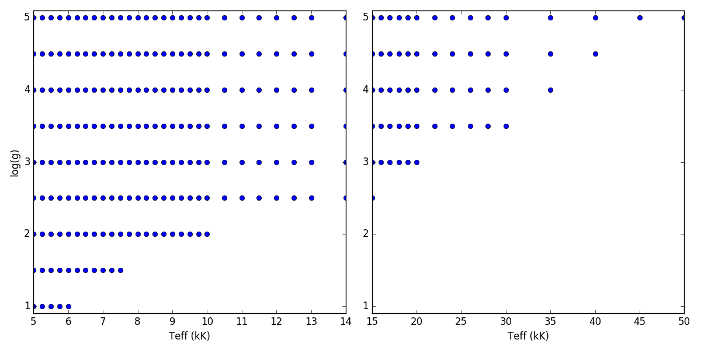
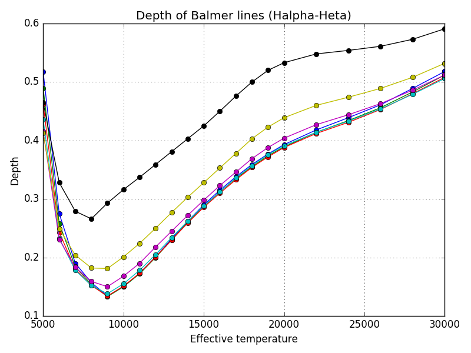
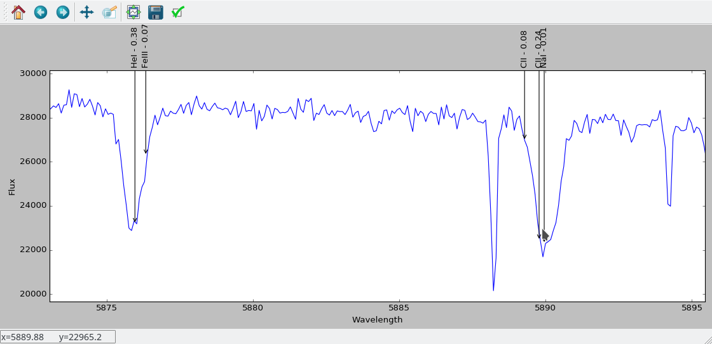

 
Identifying spectral features
=============================

For various purposes it can be useful to identify which spectral features are present in your spectra. For exampple, for RV determination it might be necessary to check that the lines you are using cannot be contaminated by the companion. 

In composite sdB binaries, differenciating between lines from the sdB and lines from the companion can usually be done based on the line broadening. In most cases the sdB will be rotating slowely, and will only have H, He and sharp metal lines visible in the spectra. Most of the companions are spun up, and will have broader line profiles. 

Mendelev's Table
----------------
   ::
  
     1  H  Hydrogen   11 Na Natrium    21 Sc Scandium  31 Ga Gallium    41 Nb Niobium    51 Sb Antimony 
     2  He Helium     12 Mg Magnesium  22 Ti Titanium  32 Ge Germanium  42 Mo Molybdenum 52 Te Tellurium 
     3  Li Lithium    13 Al Aluminium  23 V  Vanadium  33 As Arsenic    43 Tc Technetium 53 I  Iodine 
     4  Be Beryllium  14 Si Silicon    24 Cr Chromium  34 Se Selenium   44 Ru Ruthenium  54 Xe Xenon 
     5  B  Boron      15 P  Phosphorus 25 Mn Manganese 35 Br Bromine    45 Rh Rhodium    55 Cs Caesium 
     6  C  Carbon     16 S  Sulfur     26 Fe Iron      36 Kr Krypton    46 Pd Palladium  56 Ba Barium 
     7  N  Nitrogen   17 Cl Chlorine   28 Ni Nickel    37 Rb Rubidium   47 Ag Silver     57 La Lanthanum 
     8  O  Oxygen     18 Ar Argon      27 Co Cobalt    38 Sr Strontium  48 Cd Cadmium    58 Ce Cerium 
     9  F  Fluorine   19 K  Potassium  29 Cu Copper    39 Y  Yttrium    49 In Indium     59 Pr Praseodymium 
     10 Ne Neon       20 Ca Calcium    30 Zn Zinc      40 Zr Zirconium  50 Sn Tin        60 Nd Neodymium 
  
     61 Pm Promethium 71 Lu Lutetium   81 Tl Thallium  91 Pa Protactinium 101 Md Mendelevium    111 Rg  Roentgenium 
     62 Sm Samarium   72 Hf Hafnium    82 Pb Lead      92 U  Uranium      102 No Nobelium       112 Uub Ununbium 
     63 Eu Europium   73 Ta Tantalum   83 Bi Bismuth   93 Np Neptunium    103 Lr Lawrencium     113 Uut Ununtrium 
     64 Gd Gadolinium 74 W  Tungsten   84 Po Polonium  94 Pu Plutonium    104 Rf Rutherfordium  114 Uuq Ununquadium 
     65 Tb Terbium    75 Re Rhenium    85 At Astatine  95 Am Americium    105 Db Dubnium        115 Uup Ununpentium 
     66 Dy Dysprosium 76 Os Osmium     86 Rn Radon     96 Cm Curium       106 Sg Seaborgium     116 Uuh Ununhexium 
     67 Ho Holmium    77 Ir Iridium    87 Fr Francium  97 Bk Berkelium    107 Bh Bohrium        118 Uuo Ununoctium 
     68 Er Erbium     78 Pt Platinum   88 Ra Radium    98 Cf Californium  108 Hs Hassium 
     69 Tm Thulium    79 Au Gold       89 Ac Actinium  99 Es Einsteinium  109 Mt Meitnerium 
     70 Yb Ytterbium  80 Hg Mercury    90 Th Thorium   100 Fm Fermium     110 Ds Darmstadtium 

Retreaving atomic line data for specific spectral types
-------------------------------------------------------

The IVS repository contains the :py:func:`get_lines`, which returns line depths for a given spectral type. This function can be very useful when identifying lines in spectra as it will only show lines that should be visible in the spectral type you are working with. Compared to VALD which will return you all possible lines in a given wavelength range, and let you deside wich ones are possible. 

.. py:function:: ivs.spectra.linelists.get_lines(teff, logg, atoms=None, ions=None, wrange=(-inf,inf), blend=0.0, return_name=False)
   
   Retrieve line transitions (wavelengths) and strengths/depths for a specific stellar type. This function was provided by Kenneth de Smedt, and the input data might be described in his `Thesis <https://fys.kuleuven.be/ster/pub/phd-thesis-kenneth-de-smedt/phd-thesis-kenneth-de-smedt>`_ (Kenneth left astronomy in 2015).
   
   Atomic data is available for spectral types with effective temperature varying from 5000 to 50000 K, and logg from 1.0 to 5.0. Only data for solar metalicity is currently available. If the requested teff, logg model does not exists, the grid point closest to it will be used.
   
   :param teff: effective temperature
   :type teff: float
   :param logg: surface gravity
   :type logg: float
   :param atoms: a list of atoms to include, can be provided as string or atom numer. If not
                 given, all atoms will be returned
   :type atoms: list
   :param ions: a list of ions to include, can be provided as string or ion numer. If not
                given, all ions will be returned
   :type ions: list
   :param wrange: the wavelength range (min, max) for which to return the line information, 
                  by default the entire available range is returned.
   :type wrange: list or tupple
   :param blend: A line is considered a blend if it is closer then this number to its neighboor.
                 Blends will be removed from the result. 
   :type blend: float
   :param return_name: If True, the name of the ions will be returned in string form otherwise
                       the numerical ioncode is returned.
   :type return_name: bool
   
   :return: array containing wavelength, ion number and line depth for all lines
   :rtype: record array

This function will return atomic data based on stored line lists. The line data is available for temperatures between 5000 and 50000 K, and surface gravity between 1 and 5. The step in surface gravity is 0.5, the step in temperature varies:

   =============  ========
   Teff range     Step (K)
   =============  ========
   5000 - 10000   200
   10000 - 13000  500
   14000 - 20000  1000
   20000 - 30000  2000
   30000 - 50000  5000
   =============  ========

Not all models are available in all logg and teff values. The existing combinations are shown in the folowing figure. If you request a teff-logg combination that is not a grid point, the closest grid point will be returned. This is also the case if you request a point outside the grid. No interpolation of any kind is done.

Atomic and ion numbers
^^^^^^^^^^^^^^^^^^^^^^

The :py:func:`get_lines` returns the ion code in numerical form, which is defined by the atom number and the ionisation step as a decimal. So 2.01 is HeII. To convert between numerical and string representation for ions you can use the :py:func:`ioncode2name` and :py:func:`name2ioncode` functions, both part of the linelists module of the ivs repository.

.. code-block:: python

   ioncode2name(14.02)
   'SiIII'
   
   name2ioncode('SiIII')
   14.02

Examples:
^^^^^^^^^

Retrieve all Silicon lines between 4500 and 4600 for a B1V star

.. code-block:: python
 
   data = get_lines(20000, 4.0, atoms=['Si'], wrange=(4500,4600))
   rec.array([(4552.622, 14.02, 0.337), 
              (4567.840, 14.02, 0.303),
              (4574.757, 14.02, 0.228)], 
              dtype=[('wavelength', '<f8'), ('ion', '<f8'), ('depth', '<f8')])
   
See how the depth of the Halpha line varies with temperature:

.. code-block:: python

   teffs = range(5000,21000,1000) + range(22000,32000,2000) + range(30000,50000,50000)
   depths = np.zeros((len(teffs),7))
   for i,teff in enumerate(teffs):
       data = get_lines(teff,5.0,ions=['HI'],wrange=(3800,7000))
       depths[i] = data['depth']
   
   p = pl.figure();p = pl.title('Depth of Balmer lines (Halpha-Heta)')
   p = pl.plot(teffs,1-depths,'o-')
   p = pl.xlabel('Effective temperature');p = pl.grid()
   

Spectral Feature Identifier
---------------------------

Spectral Feature Identifier or SFI for short is a small python program that lets you interactively identify spectral lines, based on the IVS repository. You can load a spectrum, select what kind of spectral model (teff, logg) you want, and change the radial velocity shift. When a line is clicked, the closest spectral lines will be shown, together with their expected line depths. A download link is provided at the bottom of the page under Python sources. 

usage::
   
   >>> python sfi.py spectrum [-h] [-bin BINSIZE] [-vrad VRAD] [-teff TEFF] [-logg LOGG]
   
   Program to interactively identify spectral lines. Author: Joris Vos
   
   positional arguments:
   spectrum      The filename of the spectrum (ascii, fits)

   optional arguments:
   -h, --help    show this help message and exit
   -bin BINSIZE  binsize for rebinning (default=1)
   -vrad VRAD    radial velocity of the spectrum (default=0)
   -teff TEFF    Effective temperature of the star (default=6000)
   -logg LOGG    surface gravity of the star (default=4.5)

Screen shot:

On-line sources
---------------

The Vienna atomic line database (VALD)
^^^^^^^^^^^^^^^^^^^^^^^^^^^^^^^^^^^^^^

The Vienna Atomic Line Database (VALD) is a collection of atomic and molecular transition parameters of astronomical interest. VALD offers tools for selecting subsets of lines for typical astrophysical applications: line identification, preparing for spectroscopic observations, chemical composition and radial velocity measurements, model atmosphere calculations etc. 

http://vald.astro.uu.se/

The NIST Atomic Spectra Database
^^^^^^^^^^^^^^^^^^^^^^^^^^^^^^^^

The spectroscopic data collection of the National Institute of Standards and Technology (NIST).

https://www.nist.gov/pml/atomic-spectra-database

The Atomic Line List
^^^^^^^^^^^^^^^^^^^^

A compilation of approximately 923,000 allowed, intercombination and forbidden atomic transitions with wavelengths in the range from 0.5 Å to 1000 µm. It's primary intention is to allow the identification of observed atomic absorption or emission features. The wavelengths in this list are all calculated from the difference between the energy of the upper and lower level of the transition. No attempt has been made to include observed wavelengths. Most of the atomic energy level data have been taken from the Atomic Spectra Database provided by the National Institute of Standards and Technology (NIST). 

http://www.pa.uky.edu/~peter/atomic/

Python sources
--------------

 * SFI - Spectral Feature Indentifier: :download:`scripts/sfi.py`